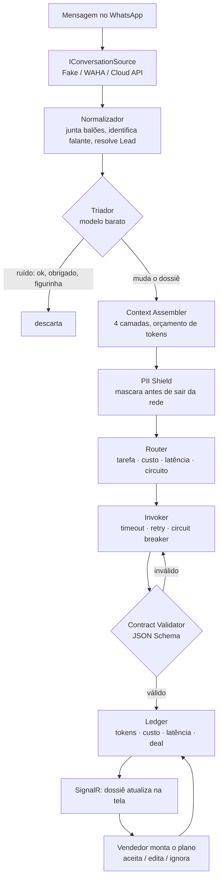

# Copiloto

**O robô não fala com o cliente. O robô nem decide a venda.**
**O robô lê, entende e entrega o dossiê. Quem monta o plano e quem vende é o vendedor.**

Copiloto conecta o WhatsApp da empresa a um CRM enxuto, lê as conversas reais com os
clientes e entrega ao vendedor um **dossiê de contexto**: em que estágio a venda está,
qual objeção acabou de aparecer (mesmo velada), e — o mais útil — **o que ainda não
sabemos sobre aquele cliente**. Com esse dossiê na tela, o vendedor monta o próprio
plano de abordagem.

Não é um chatbot. É um sistema de apoio à decisão.

---

## Por que isso, e não um chatbot

Uma IA que escreve a mensagem pronta quebra de um jeito irrecuperável: quando erra o
tom, erra na frente do cliente, e o vendedor nunca mais confia na ferramenta. Uma IA
que entrega **leitura da conversa** erra barato — o vendedor discorda, ajusta e segue.
A ferramenta sobrevive ao próprio erro.

E resolve o problema que mata produto de IA em vendas: **vendedor bom não usa script de
robô, usa informação.** "Esse cliente citou preço 3 vezes e sumiu por 4 dias depois da
proposta" serve para o campeão e para o novato. Mensagem pronta só serve para o novato —
e é o campeão quem decide se a ferramenta fica na empresa.

---

## A tela

```
+----------------------------------+---------------------------------+
|  CONVERSA DO WHATSAPP            |  DOSSIÊ DO CLIENTE (IA)         |
|                                  |                                 |
|  cliente: bom dia, vi o café     |  Estágio: Negociação            |
|  cliente: qual o valor do kg?    |  Temperatura: mornando  ↓       |
|  você: bom dia! o Bourbon...     |  Última interação: há 4 dias    |
|  cliente: puxado hein            |                                 |
|  cliente: vou pensar             |  SINAIS  (cada um cita a fala)  |
|  [4 dias de silêncio]            |  • preço citado 3x              |
|                                  |  • "vou pensar" = objeção velada|
|                                  |  • perguntou frete = intenção   |
|                                  |                                 |
|                                  |  AINDA NÃO SABEMOS              |
|                                  |  • volume mensal                |
|                                  |  • cafeteria ou consumo próprio |
|                                  |  • quem decide a compra         |
+----------------------------------+---------------------------------+
|  MEU PLANO DE ABORDAGEM     (o vendedor monta; a IA oferece blocos) |
|  Objetivo desta conversa : ____________________________  [sugerir]  |
|  Preciso descobrir       : ____________________________  [sugerir]  |
|  Objeção provável        : ____________________________  [sugerir]  |
|  Próximo passo           : ____________________________  [sugerir]  |
+---------------------------------------------------------------------+
```

`[sugerir]` é sob demanda. Cada bloco proposto vem com **a técnica declarada** e a
**ancoragem** — de qual dado do CRM ou de qual trecho da conversa aquilo saiu. O vendedor
aceita, edita ou ignora, e as três ações viram métrica.

---

## O que este projeto quer demonstrar

Isto não é um wrapper de LLM. As peças que importam:

| Peça | O que resolve |
|---|---|
| **Router de modelos** | Classificar é barato e instantâneo; estratégia pode gastar 3s e um modelo forte. Escolha por tarefa, custo, latência e estado do circuito. |
| **Context Assembler** | Conversa de 3 meses não cabe em contexto nenhum. 4 camadas com orçamento de tokens e corte por prioridade. |
| **Contrato por agente** | Saída validada contra JSON Schema. Não validou, reprompt com o erro; 2 falhas, próximo modelo da cascata. |
| **Circuit breaker** | Por provedor, com teste que abre e fecha o circuito. |
| **Idempotência** | Webhook de WhatsApp reentrega mensagem. Sem isso, você paga duas vezes pela mesma análise. |
| **PII Shield** | CPF, telefone e e-mail são mascarados antes de sair da rede. Teste falha se vazar. |
| **Ledger + ROI** | Custo por invocação, ligado ao Deal. Responde quanto gastou **e quanto rendeu**. |

### A parte que quase ninguém faz: a conta fechada

Quase todo projeto de IA sabe dizer o que **gastou**. Praticamente nenhum sabe dizer o
que **rendeu**. Aqui o ledger liga cada invocação ao negócio, e o painel mostra receita
influenciada ÷ custo de IA, custo por deal ganho, e o **custo dos blocos ignorados** —
o desperdício, explícito.

> **Ressalva metodológica, que também está escrita dentro do painel:** a comparação
> entre negócios que usaram o copiloto e negócios que não usaram **não é um experimento
> controlado**. O vendedor escolhe quando usar a ferramenta, e provavelmente a usa nos
> casos mais difíceis ou nos mais promissores. Isso é viés de seleção. O número indica
> direção, não prova causalidade.

---

## Arquitetura



Detalhes em [`docs/ARQUITETURA.md`](docs/ARQUITETURA.md).

---

## Os agentes

Não existe uma IA só cuidando de tudo. São sete, cada um com prompt versionado em
arquivo, JSON Schema de saída e teste com resposta gravada:

| | Agente | Papel | Custo |
|---|---|---|---|
| A0 | Triador | Vale acordar o modelo caro? | mínimo |
| A1 | Leitor | Estágio, temperatura, sinais de compra e de fuga | médio |
| A2 | Resumidor | Comprime conversa antiga (fora do caminho crítico) | barato |
| A3 | Detector de objeção | Objeção explícita e velada | médio |
| A4 | Lacunas | O que ainda **não** sabemos (BANT) | médio |
| A5 | Conselheiro de plano | Só sob demanda, no botão `[sugerir]` | forte |
| A6 | Vigia | Job agendado: conversa esfriando, proposta vencendo | barato |

## MCP e RAG

**MCP entra nos dois sentidos.** O CRM **é** um servidor MCP — dossiê, negócios
parados e histórico viram ferramentas que qualquer cliente MCP consome, então o CRM
deixa de ser um destino e vira capacidade componível. E o orquestrador **consome**
ferramentas MCP para buscar estoque, preço vigente e prazo real.

O segundo uso é o que justifica MCP aqui: a regra de ancoragem abaixo deixa de ser
uma instrução no prompt — que um modelo pode ignorar — e vira propriedade da
arquitetura. Se a ferramenta não devolveu o dado, ele não está no contexto, e não há
o que inventar.

**RAG entra em um lugar só, de propósito:** recuperar como objeções semelhantes foram
convertidas *nesta empresa*, a partir de conversas encerradas com desfecho conhecido —
inclusive as que foram perdidas. É a diferença entre um conselho que serve para
qualquer negócio e um que só faz sentido neste.

Onde RAG **não** entra, e por quê: no playbook (são ~800 tokens, cabem inteiros no
contexto — indexar o que já cabe é custo e latência para resolver um problema
inexistente) e em banco vetorial dedicado (`pgvector` roda no Postgres que já está
aqui, com o mesmo backup e a mesma transação). E o RAG só fica se provar que melhora
o dossiê contra o baseline sem ele. Detalhes em [`docs/ARQUITETURA.md`](docs/ARQUITETURA.md).

### Regra de ancoragem

Escassez, prova social, desconto e prazo **só viram sugestão de fala se existir dado no
CRM que sustente**. Sem dado, o agente é obrigado a devolver como pergunta ao vendedor
("existe prazo real nessa proposta?"), nunca como fala pronta.

O motivo é prático antes de ser ético: sugerir "diz que só restam 2 unidades" quando
existem 200 é publicidade enganosa, cria passivo para a empresa que usa o produto, e
queima o vendedor com o cliente. Há teste automatizado para isso.

---

## Stack

.NET 9 (Minimal API) · EF Core 9 · PostgreSQL 16 · SignalR · React 19 + Vite · xUnit

**Sem Semantic Kernel e sem LangChain**, por decisão. Roteador, cascata de fallback e
circuit breaker são escritos à mão — um framework de orquestração esconderia exatamente
o que este projeto existe para mostrar.

---

## Fontes de conversa

Tudo entra por `IConversationSource`, com três implementações trocáveis por configuração:

| Implementação | Uso | Observação |
|---|---|---|
| **FakeSource** | padrão | Replay de conversas gravadas em JSON. Roda offline e de graça. A demo não depende de rede. |
| **WahaSource** | desenvolvimento | Bridge não-oficial do WhatsApp Web. **Contraria os termos da Meta e o risco concreto é banimento do número** — usar apenas com chip dedicado, nunca o número principal da empresa. |
| **CloudApiSource** | produção | WhatsApp Cloud API oficial. |

O núcleo não sabe nem se importa de onde a mensagem veio.

---

## Status

Em construção. Acompanhe pelos [milestones](../../milestones) e pelas
[issues](../../issues) — o histórico de issues é parte deliberada do projeto.

## Licença

MIT
